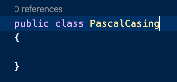
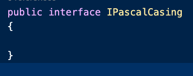
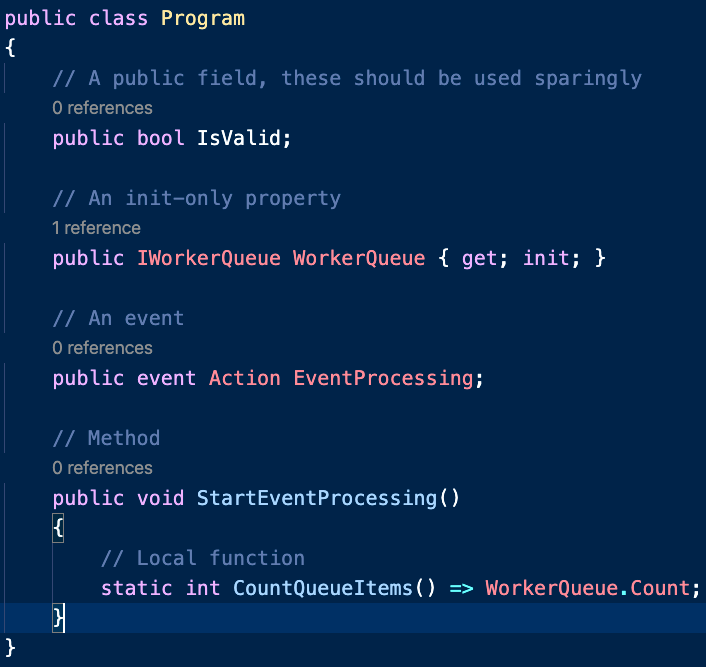
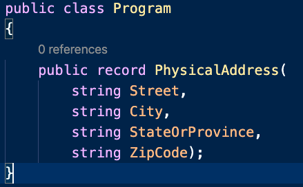
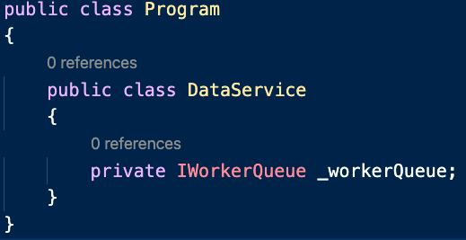
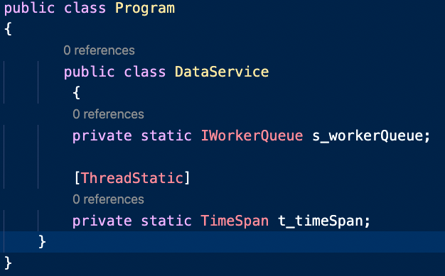
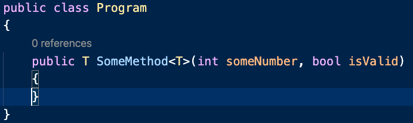

# C-Sharp Intro

C#(pronounced C-Sharp) is a programming language that runs on the .NET framework.

It is an object oriented, type-safe programming language created by Microsoft and has roots in the C family. C# is very similar to other languages like C++ and Java. C# was created in 2002 and the current version C# 8 was created in September of 2019.

## Why C-Sharp?

C# is used for many different things. Here are just a few:
* Web Services
* Desktop Applications
* Web Sites
* Games
* VR
* Database Applications

C# runs on the .NET framework, for more information on that check out, [what is .NET?](.NET-intro.md)

## C-Sharp basics!

### Compiled Language
 C# is a compiled language, compiled languages are compiled by a compiler to an intermediate language. This executes faster than interpreted languages like Python which are read line by line as the program is executed. That is one of the benefits of C# and other compiled languages like it like C++ and Java. They are also really good at catching errors before the program actually runs! In C# when a program is compiled that is called a "build" this will compile and send out any errors or warnings about the code before it actually runs. This is annoying to most people but try and look at it as a helpful tool to warn you about errors in your code and to help you write better code.

### Casing in C#
There are a few different ways to write code in C# in different casing. Here are definitions of each type and examples.

Use pascal casing (PascalCasing) when naming a class, record or struct. 

When naming an interface use pascal casing with a prefix of an I before it (IPascalCasing)

When naming public members of types such as fields, properties, events, methods, and local functions use pascal casing.

When writing positional records, use pascal casing for parameters as theyre the public properties of the record.

Use camel casing (camelCasing) when naming private or internal fields, and prefix them with _ (_camelCasing).

When working with static fields that are private or internal, use the s_ (s_camelCasing) prefix and for thread static use t_ (t_camelCasing).

When writing method parameters, use camel casing.

Do not worry so much about Casing, it will not be looked at. This is just to help you get comfortable with the language and if you wish you continue to use c# later.

If you have any other questions see [C# Coding Style](https://github.com/dotnet/runtime/blob/main/docs/coding-guidelines/coding-style.md).

For a more in depth look at C# and how it works look at Microsofts website [here](https://docs.microsoft.com/en-us/dotnet/csharp/tour-of-csharp/).

If you would like to move on to coding, [create your first project!](firstproject.md)