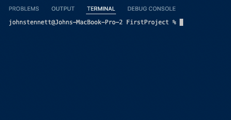
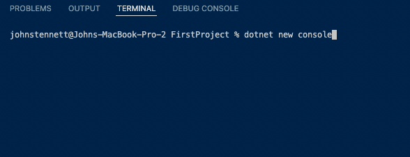
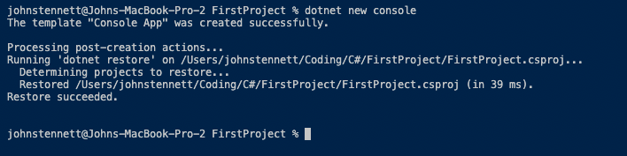

# Create your first Dotnet Project!

## Terminal
.NET works a bit different when creating a project than a language like Python. Here we will walk through the steps.

1. First create a folder titled 'FirstProject'
2. Next you need to open Visual Stuido Code and open that new folder.
3. Then open a new terminal. Make sure the terminal is inside the folder.

4. Now type in the terminal 'dotnet new console' and press enter.

(After you press enter)

What just happened?

Now you will notice you have a few new files in that folder you are in. The Program.cs file is a C# file and is where the program will run when you build and run it.

The other file is the .csproj file. This is a file that communicates with the .NET framework to run the program using the correct frameworks and such. You will not have to worry about that file.

The other folder you see has a lot of files that you do not need to know about right now.

Now to run your program.cs file you will need to go back into the terminal and do the following.

1. Type 'dotnet build'

This will compile and build the program. This will also give us any errors in the program before it actually runs if there are any.

1. Type 'dotnet run'

This will now run the compiled code and you will see "Hello World!" appear in the terminal.

Great! If you are comfortable with this then lets move on to the [C# Syntax](../Syntax/Syntax.md)